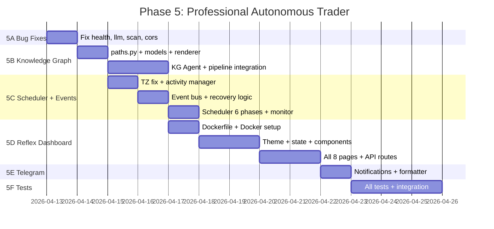

# Phase 5: Professional Autonomous Swing Trader — Extended Implementation Plan

> Transform swingtradev3 from a "smart research tool" (4.9/10) into a **professional-grade autonomous swing trader** (8+/10).
> All decisions finalized. All feasibility issues resolved.
> Last Updated: April 13, 2026

---

## Finalized Decisions

| Item | Decision | Rationale |
|------|----------|-----------|
| **Dashboard** | Reflex (separate Docker service) | Mobile-responsive, reactive WebSocket UI, no Streamlit reruns |
| **Dashboard Docker** | New `Dockerfile.dashboard` | Needs Node.js 20 for Reflex compilation, separate from FastAPI |
| **Dashboard Port** | 3000 internal → 8502 external | Avoids conflict with FastAPI on 8000 |
| **Knowledge Graph** | Karpathy-style Markdown | Git-versionable, LLM-native, zero dependencies |
| **KG Context Loading** | ScorerAgent calls `get_stock_context()` inline | Reads PREVIOUS scans' files before scoring, KG agent writes AFTER pipeline |
| **Scheduler** | Keep `schedule` library | Proven with asyncio.create_task, no thread issues like APScheduler |
| **Timezone** | `TZ=Asia/Kolkata` in docker-compose | All market time logic uses IST |
| **Telegram** | Notifications only | Approvals via dashboard. Remove callbacks, keyboards, polling |
| **Failed Events** | Persist + auto-retry + alert user | Dashboard shows failed events, Telegram alerts, 3x retry with backoff |
| **ngrok** | For phone access to dashboard | `make tunnel` for quick access |

---

## Architecture: Final Design

```
┌─────────────────────────────────────────────────────────┐
│                     HOST MACHINE                         │
│                                                          │
│  ┌──────────────────────┐    ┌────────────────────────┐  │
│  │  app container        │    │  dashboard container    │  │
│  │  (python:3.12-slim)  │    │  (python:3.12 + node20)│  │
│  │                      │    │                        │  │
│  │  FastAPI :8000 ────────────── Reflex :3000         │  │
│  │  ├── /health         │    │  ├── Command Center    │  │
│  │  ├── /scan           │ ←→ │  ├── Portfolio         │  │
│  │  ├── /positions      │HTTP│  ├── Research          │  │
│  │  ├── /trades         │    │  ├── Approvals         │  │
│  │  ├── /approvals      │    │  ├── Trade Journal     │  │
│  │  ├── /agent-activity │    │  ├── Knowledge Graph   │  │
│  │  ├── /knowledge-graph│    │  ├── Agent Activity    │  │
│  │  ├── /failed-events  │    │  └── Learning          │  │
│  │  └── ws://           │    │                        │  │
│  │                      │    └────────────────────────┘  │
│  │  Scheduler (schedule)│         :8502 (host port)      │
│  │  Event Bus (asyncio) │                                │
│  │  Knowledge Graph I/O │    ┌────────────────────────┐  │
│  │                      │    │  kite-mcp container     │  │
│  └──────────────────────┘    │  MCP :8080              │  │
│       :8001 (host port)      └────────────────────────┘  │
│                                   :8081 (host port)      │
│  ┌──────────────────────┐                                │
│  │  ngrok tunnel         │                                │
│  │  :8502 → public URL  │                                │
│  └──────────────────────┘                                │
│       → Phone access                                     │
└─────────────────────────────────────────────────────────┘
```

---

## How the Knowledge Graph Works

### The Problem

Today, each research scan writes isolated JSON files:
```
context/research/2026-04-12/RELIANCE.json   ← Day 1: Score 7.5
context/research/2026-04-13/RELIANCE.json   ← Day 2: Score 8.2
context/research/2026-04-14/RELIANCE.json   ← Day 3: Score 6.0
```
**These files don't know about each other.** The ScorerAgent can't see that RELIANCE was scored 7.5 yesterday. The learning loop can't track that "pullback setups on energy stocks have a 80% win rate."

### The Solution: Karpathy-Style Wiki

Instead of flat JSON, we maintain **structured Markdown notes** with `[[wikilinks]]` that the LLM agents actively update:

```
context/knowledge/
├── wiki/
│   ├── stocks/RELIANCE.md          ← Accumulates ALL research on RELIANCE
│   ├── stocks/INFY.md
│   ├── sectors/Energy.md           ← Tracks sector-level patterns
│   ├── themes/FII_selling.md       ← Cross-cutting observations
│   └── trade_journal/T001.md       ← Post-mortem linked to stock note
├── _index.json                     ← Fast lookups (ticker → scan history)
└── _graph.json                     ← Nodes & edges for dashboard rendering
```

### Data Flow (Step by Step)

#### Step 1: Research Scan Runs
```
RegimeAgent → FilterAgent → ScannerAgent → ScorerAgent(+inline KG read) → ResultsSaverAgent → KnowledgeGraphAgent(writes)
```

#### Step 2: KnowledgeGraphAgent Updates Stock Note
The agent opens `stocks/RELIANCE.md` and **appends** the new scan:

```markdown
---
ticker: RELIANCE
sector: Energy
scan_count: 3        ← Incremented
avg_score: 7.2       ← Recalculated
last_scanned: 2026-04-14
---
# RELIANCE Industries

## Scan History
| Date       | Score | Setup    | Shortlisted |
|------------|-------|----------|-------------|
| 2026-04-14 | 6.0   | Pullback | ❌          |  ← NEW ROW ADDED
| 2026-04-13 | 8.2   | Breakout | ✅          |
| 2026-04-12 | 7.5   | Pullback | ✅          |

## Connections
- Sector: [[Energy]]
- Correlated: [[ONGC]], [[BPCL]]
- Trade: [[T001_RELIANCE_2026-04-13]]
```

The agent also updates `_index.json` for fast lookups and `_graph.json` for visualization.

#### Step 3: Next Scan Uses Historical Context (CORRECTED)
Before the ScorerAgent scores RELIANCE again, it calls `get_stock_context()` **inline** to read from PREVIOUS scans' markdown:

```
SYSTEM PROMPT (to LLM):
"RELIANCE was scored 8.2 last scan (breakout setup, shortlisted).
Before that: 7.5 (pullback, shortlisted). Trade T001 resulted in +10% profit.
Current sector: Energy is showing weakness.
What has materially changed?"
```

This is the **killer feature**: the LLM makes **comparative judgments** instead of scoring from scratch every time.

#### Step 4: Trade Closes → Trade Journal Created
When a trade on RELIANCE closes, the `TradeReviewerAgent` creates:

```markdown
# T001: RELIANCE — 2026-04-13

## Summary
- Entry: ₹1000 (Breakout setup, score 8.2)
- Exit: ₹1100 (Target hit)
- P&L: +10% ✅
- Duration: 5 days

## What Worked
- Clean breakout above 200-DMA
- FII buying supported the move

## Connections
- Stock: [[RELIANCE]]
- Sector: [[Energy]]
- Setup type: Breakout
```

And updates `RELIANCE.md` to link the trade outcome.

#### Step 5: Dashboard Renders the Graph
The dashboard reads `_graph.json` and renders an interactive graph:
- **Stock nodes** (sized by scan count, colored by avg score)
- **Sector nodes** (colored by regime)
- **Theme nodes** (sized by frequency)
- **Trade nodes** (green = profit, red = loss)
- **Edges**: Stock↔Sector, Stock↔Theme, Stock↔Trade, Stock↔Stock (correlation)

Click any node → see the full markdown note rendered as HTML.

### Why This Works Better Than a Database

| Approach | Knowledge Graph (Markdown) | SQLite/JSON | Neo4j |
|----------|--------------------------|-------------|-------|
| Human readable | ✅ Open in any editor | ❌ Binary/JSON | ❌ Requires client |
| LLM can read/write | ✅ Native (markdown) | 🟡 Needs SQL | 🟡 Needs Cypher |
| Relationships | ✅ `[[wikilinks]]` | ❌ Foreign keys | ✅ Graph queries |
| Zero dependencies | ✅ Just files | ✅ stdlib | ❌ Docker container |
| Git-versionable | ✅ Markdown diffs | 🟡 Binary changes | ❌ Not practical |
| Obsidian compatible | ✅ Open as vault | ❌ N/A | ❌ N/A |
| Dashboard visualizable | ✅ Parse `_graph.json` | 🟡 Build manually | ✅ Native |

---

## Phase 5A — Critical Bug Fixes (Day 1)

### [MODIFY] [health_manager.py](file:///home/devadethanr/projects/kepler/swingtradev3/health_manager.py)
- Add `Any` to `from typing import ...` imports
- **Impact:** Fixes runtime NameError crash

### [MODIFY] [llm_bridge.py](file:///home/devadethanr/projects/kepler/swingtradev3/llm_bridge.py)
- Fix retry decorator: catch `httpx.HTTPStatusError`, `Exception` alongside `ServerError`
- Fix provider detection: check provider chain membership, not `"meta" in model_str`
- **Impact:** Fixes fallback from NIM → Gemini when NIM is down

### [MODIFY] [scan.py](file:///home/devadethanr/projects/kepler/swingtradev3/api/routes/scan.py)
- Unique session IDs: `f"scan_{datetime.now().strftime('%Y%m%d_%H%M%S')}"`
- Persist `scan_status_store` to `context/scan_status.json` via `storage.write_json()`
- Add `asyncio.Lock` concurrency guard
- **Impact:** Fixes state contamination between concurrent scans

### [MODIFY] [main.py](file:///home/devadethanr/projects/kepler/swingtradev3/api/main.py)
- CORS: `allow_origins=["http://localhost:8502", "http://localhost:3000"]`
- Exception handler: remove `str(exc)` in production
- **Impact:** Security hardening

### [MODIFY] [morning_briefing.py](file:///home/devadethanr/projects/kepler/swingtradev3/api/tasks/morning_briefing.py)
- Wire `TelegramClient.send_briefing()` with ngrok link
- **Impact:** Morning briefings actually delivered

---

## Phase 5B — Knowledge Graph Engine (Days 2-4)

### [MODIFY] [paths.py](file:///home/devadethanr/projects/kepler/swingtradev3/paths.py)
```python
KNOWLEDGE_DIR = CONTEXT_DIR / "knowledge"
```
- Add to `ensure_runtime_dirs()`:
```python
KNOWLEDGE_DIR / "wiki" / "stocks",
KNOWLEDGE_DIR / "wiki" / "sectors",
KNOWLEDGE_DIR / "wiki" / "themes",
KNOWLEDGE_DIR / "wiki" / "trade_journal",
KNOWLEDGE_DIR / "raw" / "scans",
KNOWLEDGE_DIR / "raw" / "news",
```

### [NEW] `agents/knowledge/__init__.py`
### [NEW] `agents/knowledge/knowledge_models.py`
Pydantic models: `StockNote`, `ScanHistoryEntry`, `TradeJournalEntry`, `KnowledgeIndex`, `GraphNode`, `GraphEdge`

### [NEW] `agents/knowledge/wiki_renderer.py`
- `parse_note()` — YAML frontmatter + body parser (uses `python-frontmatter`)
- `render_note()` — Model → Markdown string
- `extract_wikilinks()` — Regex `\[\[(.*?)\]\]` parser
- `build_graph_from_directory()` — Walks all notes, returns nodes + edges

### [NEW] `agents/knowledge/knowledge_graph.py`
- `KnowledgeGraphAgent(BaseAgent)` — Pipeline sub-agent (WRITES after ResultsSaver)
- `get_stock_context(ticker) → str` — **Static method**, reads existing markdown files. Called INLINE by ScorerAgent before scoring.
- `update_stock_note()`, `create_trade_journal()`, `update_index()`, `update_graph()`, `update_sector_notes()`

### Pipeline Order (CORRECTED)

```
RegimeAgent → FilterAgent → BatchScannerAgent → ScorerAgent(+inline KG read) → ResultsSaverAgent → KnowledgeGraphAgent(writes)
```

**How it works:**
1. ScorerAgent iterates through each stock to score
2. Before scoring, it calls `KnowledgeGraphAgent.get_stock_context(ticker)` — this reads markdown files from PREVIOUS scans
3. Historical context is injected into the LLM scoring prompt
4. After all scoring is done, ResultsSaverAgent saves raw JSON
5. KnowledgeGraphAgent runs last and WRITES updated markdown notes, index, and graph

### [MODIFY] [scorer_agent.py](file:///home/devadethanr/projects/kepler/swingtradev3/agents/research/scorer_agent.py)
```python
# Before scoring each stock, load historical context
from agents.knowledge.knowledge_graph import KnowledgeGraphAgent
kg = KnowledgeGraphAgent()
for stock in qualified_stocks:
    historical_ctx = kg.get_stock_context(stock["ticker"])
    prompt = f"...Historical Context:\n{historical_ctx}\n..."
    score = await smart_router.generate(prompt, ...)
```

### [MODIFY] [pipeline.py](file:///home/devadethanr/projects/kepler/swingtradev3/agents/research/pipeline.py)
```python
research_pipeline = SequentialAgent(
    name="ResearchPipeline",
    sub_agents=[
        RegimeAgent(),
        FilterAgent(),
        BatchScannerAgent(),
        ScorerAgent(),          # Reads KG inline via get_stock_context()
        ResultsSaverAgent(),
        KnowledgeGraphAgent(),  # WRITES to KG after all scoring done
    ],
)
```

### [MODIFY] [reviewer.py](file:///home/devadethanr/projects/kepler/swingtradev3/agents/learning/reviewer.py)
- After trade review, call `kg.create_trade_journal(trade)` to create linked post-mortem

### [MODIFY] [requirements.txt](file:///home/devadethanr/projects/kepler/swingtradev3/requirements.txt)
```
python-frontmatter>=1.1
```

---

## Phase 5C — 24-Hour Scheduler + Event Bus (Days 4-6)

### [MODIFY] [docker-compose.dev.yml](file:///home/devadethanr/projects/kepler/docker-compose.dev.yml)
```yaml
services:
  app:
    environment:
      - PYTHONUNBUFFERED=1
      - TZ=Asia/Kolkata       # ← IST timezone for market hours
    command: >
      sh -c "uvicorn api.main:app --host 0.0.0.0 --port 8000 --reload"
    # Removed: streamlit run (moved to dashboard container)
```

### [NEW] [agent_activity.py](file:///home/devadethanr/projects/kepler/swingtradev3/agent_activity.py)
- `AgentActivityManager` singleton
- Context manager: `async with activity.track("ScorerAgent", "Scoring RELIANCE")`
- Persists to `context/agent_activity.json`

### [NEW] [event_bus.py](file:///home/devadethanr/projects/kepler/swingtradev3/event_bus.py)
- `TradingEvent` base model with retry_count
- `EventBus` with `asyncio.Queue` + subscriber pattern
- **Failed event recovery:**
  - On handler failure → persist to `context/failed_events.json` with error + timestamp
  - On startup → load failed events → send Telegram alert with count → show in dashboard
  - Auto-retry: 3 attempts with exponential backoff (5s → 25s → 125s)
  - After 3 failures → `permanently_failed` status → detailed Telegram alert
  - Dashboard Agent Activity page shows failed events list with manual "Retry" button

### [NEW] [regime_adapter.py](file:///home/devadethanr/projects/kepler/swingtradev3/regime_adapter.py)
| Regime | Position Size | Min Score | Stop Tightness | New Entries |
|--------|--------------|-----------|----------------|-------------|
| Bull | 100% | 7.0 | Normal | ✅ |
| Neutral | 75% | 7.5 | +10% | ✅ |
| Bear | 50% | 8.0 | +20% | ⚠️ High-conviction only |
| Choppy | 0% | 9.0 | +30% | ❌ Paused |

### [MODIFY] [scheduler.py](file:///home/devadethanr/projects/kepler/swingtradev3/api/tasks/scheduler.py)
**Keep `schedule` library.** Add all 6 phases with market hours guard:

| Phase | Time (IST) | Tasks |
|-------|------------|-------|
| Overnight | 10PM-6AM | GIFT Nifty, global news, overnight check |
| Pre-Market | 6AM-9:15AM | Morning briefing → Telegram, FII/DII |
| Market Hours | 9:15AM-3:30PM | Position monitor (15 min), trailing stops, VIX, news |
| Post-Market | 3:30PM-6PM | EOD data, P&L calc, position reconciliation |
| Evening | 6PM-9PM | Research pipeline + knowledge graph |
| Wind-Down | 9PM-10PM | State persistence, daily summary → Telegram |

```python
# Market hours guard
def _market_hours_monitor(self):
    now = datetime.now()  # IST (TZ=Asia/Kolkata)
    market_open = now.replace(hour=9, minute=15)
    market_close = now.replace(hour=15, minute=30)
    if not (market_open <= now <= market_close):
        return  # Skip outside market hours
    asyncio.create_task(self._run_monitor())
```

### [MODIFY] [monitor.py](file:///home/devadethanr/projects/kepler/swingtradev3/agents/execution/monitor.py)
- GTT trigger detection + event emission + activity tracking + market hours guard

### [MODIFY] [main.py](file:///home/devadethanr/projects/kepler/swingtradev3/api/main.py)
- Start event bus in lifespan, run failed event recovery on startup

### New API Routes
- `GET /api/agent-activity` — Agent statuses + run history
- `GET /api/failed-events` — Failed events list
- `POST /api/failed-events/{id}/retry` — Manual retry from dashboard

---

## Phase 5D — Reflex Dashboard (Days 6-10)

### [NEW] [Dockerfile.dashboard](file:///home/devadethanr/projects/kepler/Dockerfile.dashboard)
```dockerfile
FROM python:3.12-slim
RUN apt-get update && apt-get install -y curl unzip
RUN curl -fsSL https://deb.nodesource.com/setup_20.x | bash - \
    && apt-get install -y nodejs
COPY swingtradev3/dashboard_v2/requirements.txt .
RUN pip install -r requirements.txt
COPY swingtradev3/dashboard_v2/ /app/dashboard_v2/
WORKDIR /app/dashboard_v2
RUN reflex init
EXPOSE 3000
CMD ["reflex", "run", "--env", "dev", "--frontend-port", "3000"]
```

### [MODIFY] [docker-compose.dev.yml](file:///home/devadethanr/projects/kepler/docker-compose.dev.yml)
Add dashboard service:
```yaml
  dashboard:
    build: { context: ., dockerfile: Dockerfile.dashboard }
    container_name: swingtradev3-dashboard
    ports: ["8502:3000"]
    volumes: ["./swingtradev3/dashboard_v2:/app/dashboard_v2"]
    environment:
      - FASTAPI_URL=http://app:8000
      - FASTAPI_API_KEY=${FASTAPI_API_KEY}
      - TZ=Asia/Kolkata
    depends_on: [app]
    restart: unless-stopped
```

### [NEW] `swingtradev3/dashboard_v2/` — Full Reflex project

> [!NOTE]
> **Why Reflex**: Pure Python → compiles to React. Mobile-responsive out of the box. WebSocket-based state updates (no full page reruns like Streamlit). Built-in routing. Professional UI with Radix UI primitives.

```
dashboard_v2/
├── dashboard_v2/
│   ├── __init__.py
│   ├── dashboard_v2.py      # Main app entry
│   ├── state.py              # Global state management
│   ├── styles.py             # Dark theme, typography, colors
│   ├── components/
│   │   ├── __init__.py
│   │   ├── sidebar.py        # Navigation + system health
│   │   ├── agent_badge.py    # Agent status indicator
│   │   ├── stock_card.py     # Research result card
│   │   ├── trade_card.py     # Trade detail card
│   │   ├── graph_view.py     # Knowledge graph visualization
│   │   └── metric_card.py    # KPI metric display
│   └── pages/
│       ├── __init__.py
│       ├── command_center.py  # 🏠 System overview + all agents
│       ├── portfolio.py       # 📊 Positions + P&L + risk
│       ├── research.py        # 🔍 Scan results + stock drill-down
│       ├── approvals.py       # ⚙️ Approve/reject trades
│       ├── trade_journal.py   # 📈 All trades + equity curve
│       ├── knowledge_graph.py # 🧠 Interactive graph
│       ├── agent_activity.py  # 🤖 Pipeline view + agent runs
│       └── learning.py        # 📖 Observations + stats + SKILL.md
├── rxconfig.py
└── requirements.txt
```

#### Dashboard Pages Detail

**🏠 Command Center** (`command_center.py`)
- System health badges (API ✅, Kite ✅, LLM ✅)
- Market regime indicator (Bull/Bear/Neutral with color)
- Agent status grid: all agents with ✅ idle / 🔄 running / ❌ error
- Today's P&L summary card, open positions count
- Next scheduled task countdown
- Recent activity timeline (last 24hr)
- Failed events alert banner (if any)

**📊 Portfolio** (`portfolio.py`)
- Active positions table with real-time P&L
- Position cards: ticker, entry price, current, P&L%, days held
- Sector exposure donut chart (Plotly)
- Risk utilization gauge (% of max drawdown used)
- Mobile-friendly card layout

**🔍 Research** (`research.py`)
- Latest scan results in card grid
- Each card: ticker, score gauge, bull/bear case summary, setup type
- Historical score trend (from knowledge graph)
- Filter by score, sector, setup type
- Tap to drill-down → full stock knowledge note

**⚙️ Approvals** (`approvals.py`)
- Pending trades with approve/reject buttons
- Risk context: "This uses X% of remaining risk budget"
- Knowledge context: "RELIANCE traded 2x before, 100% win rate"
- Tap-to-approve on mobile

**📈 Trade Journal** (`trade_journal.py`)
- Equity curve chart (Plotly line, from real `trades.json`)
- All trades table: entry, exit, P&L, duration, setup type
- Stats dashboard: win rate, avg win/loss ratio, Sharpe, max DD
- Expandable trade details with reasoning + lessons

**🧠 Knowledge Graph** (`knowledge_graph.py`)
- Interactive force-directed graph
- Nodes: Stocks (score-colored), Sectors, Themes, Trades
- Click node → sidebar shows full markdown note
- Search bar for any entity
- Filter by: stocks only, sectors, themes, trades
- Renders from `_graph.json` (no Obsidian needed)

**🤖 Agent Activity** (`agent_activity.py`)
- Pipeline flowchart: Filter → Scanner → Scorer → Saver → KG (step highlighting)
- Currently running agents with progress
- Run history table: agent, start time, duration, status, result
- Failed events list with manual "Retry" button
- Error log viewer for failed runs

**📖 Learning** (`learning.py`)
- Trade observations list
- Performance stats (win rate, Kelly, Sharpe)
- SKILL.md content + staging proposals (diff view)
- Learning history timeline

### Dashboard API Routes
- `GET /api/knowledge-graph` — Graph data from `_graph.json`
- `GET /api/knowledge/stock/{ticker}` — Parsed markdown note
- `GET /api/portfolio/summary` — Positions + P&L + risk

### ngrok
- `make tunnel` → `ngrok http 8502`
- Auto-capture: `ngrok http 8502 --log=stdout | grep url` → `context/ngrok_url.txt`

---

## Phase 5E — Telegram Notifications Only (Days 10-11)

### [MODIFY] [telegram_client.py](file:///home/devadethanr/projects/kepler/swingtradev3/notifications/telegram_client.py)
**Remove:** `send_approval_request()`, `send_text_with_keyboard()`, `get_updates()`, `answer_callback_query()`, `edit_message_text()`

**Add:** `send_failed_event_alert()`, `send_vix_alert()`, `send_regime_change()`, `send_auth_expiry_warning()`

All messages end with: `"\n📊 Dashboard: {ngrok_url}"`

### [MODIFY] [formatter.py](file:///home/devadethanr/projects/kepler/swingtradev3/notifications/formatter.py)
- Pretty-formatted messages with emojis + deep links to specific dashboard pages

### [NEW] Makefile additions
```makefile
tunnel:
	ngrok http 8502

tunnel-bg:
	nohup ngrok http 8502 > /dev/null 2>&1 &
```

---

## Phase 5F — Tests (Days 11-14)

| File | Coverage |
|------|----------|
| `test_knowledge_graph.py` | Note CRUD, index, graph, context retrieval |
| `test_wiki_renderer.py` | Frontmatter parsing, rendering, wikilinks |
| `test_event_bus.py` | Events, handlers, failure persistence, retry, recovery |
| `test_scheduler.py` | All 6 phases, market hours guard, IST timezone |
| `test_regime_adapter.py` | Regime → overlay, sizing, entry pause |
| `test_order_agent.py` | Order placement, risk validation |
| `test_full_pipeline.py` | E2E: Scan → KG context → Score → Save → KG write |

Target: **85+ tests** (up from 57)

---

## Execution Order



---

## Verification Plan

### Automated Tests
```bash
cd /home/devadethanr/projects/kepler/swingtradev3 && make test
```

### Manual Verification
1. `make dev` → start system (both containers)
2. Open `http://localhost:8502` → verify Command Center shows all agent statuses
3. Trigger scan → watch Agent Activity page update live
4. Check Knowledge Graph page → verify stock-sector connections
5. `make tunnel` → get ngrok URL → open on phone → verify mobile layout
6. Check Telegram → verify all 10 notification types arrive with dashboard link (no approval buttons)
7. Portfolio page → verify real positions (if any)
8. Simulate failed event → verify dashboard banner + Telegram alert
9. Retry failed event from dashboard → verify recovery
10. Run for 24 hours → verify all 6 scheduler phases complete

---

## Open Questions

> [!IMPORTANT]
> **ngrok auth token**: ngrok requires a free account for persistent tunnels. Ensure you have an ngrok account/auth token configured. Free tier provides a public URL but it changes on each restart. For a fixed subdomain, a paid plan (~$8/mo) is needed.
